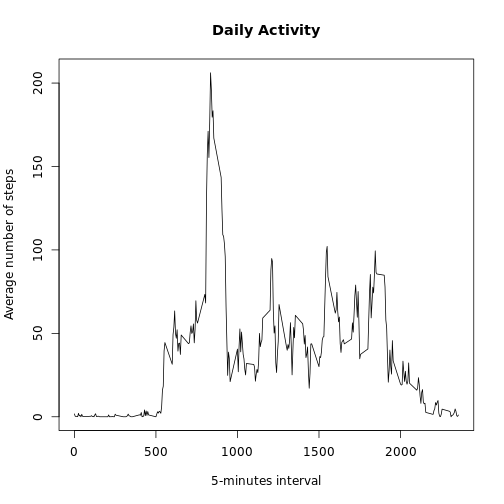
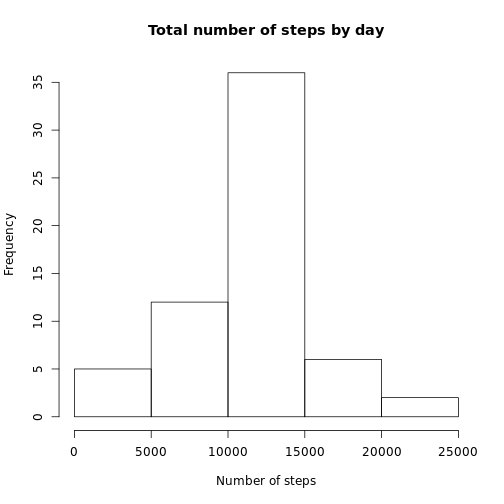
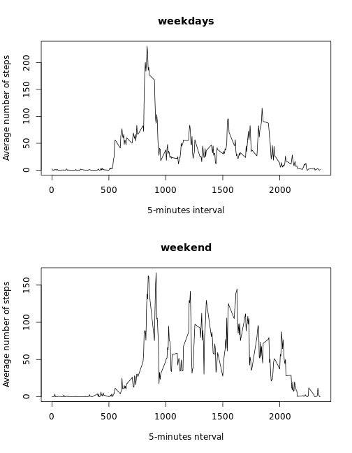

It is now possible to collect a large amount of data about personal movement using activity monitoring devices such as a Fitbit, Nike Fuelband, or Jawbone Up. These type of devices are part of the "quantified self" movement ??? a group of enthusiasts who take measurements about themselves regularly to improve their health, to find patterns in their behavior, or because they are tech geeks. But these data remain under-utilized both because the raw data are hard to obtain and there is a lack of statistical methods and software for processing and interpreting the data.

In this study, we'll use data from a personal activity monitoring device. This device collects data at 5 minute intervals through out the day. The data consists of two months of data from an anonymous individual collected during the months of October and November, 2012 and include the number of steps taken in 5 minute intervals each day.

The data can be downloaded here: [Dataset: Activity monitoring data [52K]](https://d396qusza40orc.cloudfront.net/repdata%2Fdata%2Factivity.zip)

The variables included in this dataset are:

* steps: Number of steps taking in a 5-minute interval (missing values are coded as NA)
* date: The date on which the measurement was taken in YYYY-MM-DD format
* interval: Identifier for the 5-minute interval in which measurement was taken

The dataset is stored in a comma-separated-value (CSV) file and there are a total of 17,568 observations in this dataset.

## Loading and preprocessing the data

```r
raw <- read.csv("activity.csv", na.strings = "NA", stringsAsFactors = FALSE)
```

##What is mean total number of steps taken per day?
Let's remove the missing steps values from the dataset:

```r
na_index = which(is.na(raw$steps))
data <- raw[ -na_index,]
```

and calculate the total number of steps by day:

```r
steps_by_day <- aggregate(steps ~ date, data=data, FUN=sum)
```

and graph an histogram of the result:

```r
hist(steps_by_day$steps, xlab="Number of steps", main="Total number of steps by day")
```

 

Lets's compute the mean and median of the total number of steps taken per day:

```r
mean(steps_by_day$steps)
```

```
## [1] 10766.19
```

```r
median(steps_by_day$steps)
```

```
## [1] 10765
```

## What is the average daily activity pattern?

To check the daily activity pattern, we display a time series plot of the 5-minute interval (x-axis) and the average number of steps taken, averaged across all days (y-axis):

```r
steps_by_interval <- aggregate(steps ~ interval, data=data, FUN=mean)
plot(steps_by_interval$interval, steps_by_interval$steps, type="l",
     xlab="5-minutes interval", ylab="Average number of steps", main="Daily Activity")
```

 

The graph shows that the activity (avg number of steps) is higher around the 830th 5-minutes interval in the day.
Let's find the exact value where the 5-minute interval, on average across all the days in the dataset, contains the maximum number of steps:

```r
steps_by_interval[which(steps_by_interval$steps==max(steps_by_interval$steps)),]$interval
```

```
## [1] 835
```

## Imputing missing values

Let's calculate the total number of missing values in the dataset is:

```r
sum(is.na(raw$steps))
```

```
## [1] 2304
```

Let's fill the missing values by replacing them with the mean value of the step number for that 5-interval:

```r
na_index <- which(is.na(raw$steps))
mean_by_interval <- tapply(raw$steps, raw$interval, mean, na.rm=T)
data <- raw
data[na_index,]$steps <- sapply(na_index, function(x) {
        mean_by_interval[[toString(data[x,]$interval)]]
        })
```

Once again, let's plot, the total number of steps taken each:

```r
steps_by_day <- aggregate(steps ~ date, data=data, FUN=sum)
hist(steps_by_day$steps, xlab="Number of steps", main="Total number of steps by day")
```

 

and calculate the total number of steps by day:

```r
mean(steps_by_day$steps)
```

```
## [1] 10766.19
```

```r
median(steps_by_day$steps)
```

```
## [1] 10766.19
```

The mean didn't change. The median is slightly higher than before and equal to the mean.

## Are there differences in activity patterns between weekdays and weekends?

To compare activity in weekdays and weekends, we add a new column day.type to the dataset.
The day.type column indicates whether a given date is a weekday or weekend day:


```r
library(plyr)
data$day <- as.factor(as.POSIXlt(data$date)$wday)
data$day <- mapvalues(data$day, from = c(1:5), to = rep("weekday",5))
data$day <- mapvalues(data$day, from = c(0,6), to = rep("weekend",2))
```

Let's make a panel plot containing a time series plot of the 5-minute interval (x-axis) and the average number of steps taken, averaged across all weekday days or weekend days (y-axis):

```r
wd_data = subset(data, day=="weekday")
we_data = subset(data, day=="weekend")
wd_steps_by_interval <- aggregate(steps ~ interval, data=wd_data, FUN=mean)
we_steps_by_interval <- aggregate(steps ~ interval, data=we_data, FUN=mean)
par(mfrow = c(2, 1))
plot(steps_by_interval$interval, wd_steps_by_interval$steps, type="l", 
     xlab="5-minutes interval", ylab="Average number of steps", main="weekdays")
plot(steps_by_interval$interval, we_steps_by_interval$steps, type="l",
     xlab="5-minutes nterval", ylab="Average number of steps", main="weekend")
```

 

The maximum of the average of number of steps is in the weekdays (around the 900th 5-minutes interval) but the average number of steps is higher in the weekend after the 1000th 5-minutes interval.
